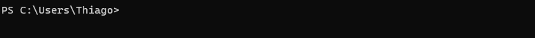
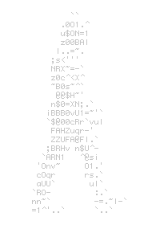

# Welcome 👋



<!-- [](https://github.com/anuraghazra/github-readme-stats) -->


 <div>
  <a href="https://github.com/s7Thiago">
  
  
</div>
  
  <div style="display: inline_block"><br>
  
  
  
  
  
  
  
  
  
  
</div>
  
  <div> 
<a href="https://www.linkedin.com/in/s7thiago/" target="_blank"></a> 
<a href = "mailto:thyagosousasilva.com"></a>
<a href = "mailto:euthiagosilva@protonmail.com"></a>
<a href="https://discord.gg/Thiago Silva#2382" target="_blank"></a> 
 
  
 
</div>

<!-- <details>
  <summary markdown="span">Expand to see more details 😎  </summary>

```dart
import './me.dart';
import './value_and_quality.dart';

class About extends Me {

 // Here's an of my biggest goals ever 🎯
 ValueAndQuality futureGoal() => ValueAndQuality(
        target:
            'Use technology to help people and solve problems wherever I go 💗',
      );


  // A little About myself 👨🏾‍💻
  var ABOUT_ME = Me(
    name: 'Thiago Silva',
    workplace: Workplace(
      company: 'STJ - Superior Tribunal de Justiça',
      position: 'Full-Stack Web Developer',
      level: 'Intern',
    ), // Workplace


    // Some skills i have used 💻
    skills: [
      'Flutter',
      'Dart',
      'java',
      'Spring Boot',
      'JavaScript',
      'TypeScript',
      'Angular',
      'GitFlow',
      'SQL',
      'C',
    ],


    // Some skills i have learning 👨🏾‍🎓
    learning: [
      'Regex',
      'MongoDB',
      'MySQL',
      'PostgreSQL',
      'SQL Server',
      'Aqueduct',
      'Adobe XD',
      'Adobe Illustrator',
      'ReactJS',
      'React Native',
      'Node.js',
      'Python',
    ],
  ); // Me
}
```



</details> -->

#
<div style="display:flex;width:70%;">
<a style="display:flex;flex-direction:co-reverse;" href="https://thiago-silva.netlify.app/#/" target="_blank">Access my personal page </a>
</div>
